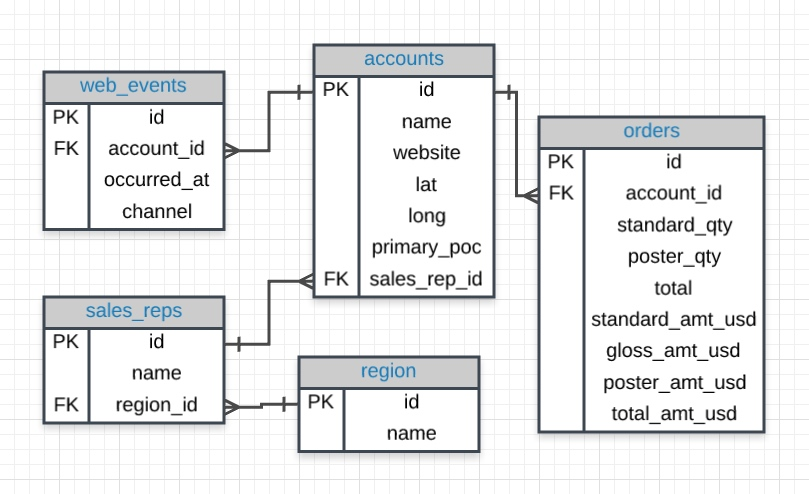

# week2/12 本周导学

## 前面的话

同学们，第1周我们就干掉了一个项目，一定很兴奋吧！如果进度拉下了请优先提交项目再开始本周的学习。这周开始的4周内，我们将会完成第二个项目，从时间安排来讲，大家也能看到是个大部头，那么我们来拆解一下：

**项目2:探索美国共享单车数据**

> - 项目说明:在此项目中，你将利用 Python 探索与以下三大美国城市的自行车共享系统相关的数据：芝加哥、纽约和华盛顿特区。你将编写代码导入数据，并通过计算描述性统计数据回答有趣的问题。你还将写一个脚本，该脚本会接受原始输入并在终端中创建交互式体验，以展现这些统计信息。
> - 练习目标：数据分析过程、数据整理、探索和可视化
> - 项目概述：请先看下这一页，对项目有个感触：
https://classroom.udacity.com/nanodegrees/nd002-cn-basic-vip/parts/0ad43cea-8e74-4486-911c-d1fae2f03c97/modules/134150b9-81b0-40d1-9c2c-bb288bb49d55/lessons/e5bef1dd-5031-45c3-aaf7-8536f6f3cf8a/concepts/8846274e-0239-4eef-8619-f9854a068ca8

另外，为了能够顺利完成项目2，请准备好以下环境：

> 1. （非必须但推荐）本地Anaconda环境，安装后可以运行：Python3、Jupyter Notebook、Spyder
>   1. Anaconda的安装和Jupyter Notebook的安装配置请见可选内容：https://classroom.udacity.com/nanodegrees/nd002-cn-basic-vip/parts/e566ad37-6119-4448-a6bc-7ade73ef3992
>   1. spyder的简单教程：https://blog.csdn.net/LucyGill/article/details/78068985
> 1. 如果想自己安装也可以选择Atom和Sublime两个，和Spyder是一样的，但要单独安装，有点麻烦。当然，有经验的同学用自己习惯的就好了

## 学习计划

看着还挺丰富的对吧，还记得我们完成项目的3个阶段么？

> 1. 第一阶段，攻克所有重难点，完成项目梗概（高强度学习阶段）；
> 2. 第二阶段，提交和修改（提交阶段）；
> 3. 第三阶段，进度慢点同学的查漏补缺（灵活假期），这样前紧后松的节奏来安排的。

这4周我们讲完成**/4. Python入门/**部分的所有内容，拆分后的每周工作是这样的：

| 时间 | 学习重点 | 对应内容（按照名字找就好了） |
| --- | --- | --- |
| 第1周 | Python基础内容 | 数据类型和运算符、控制流、函数、脚本编写 |
| 第2周 | Python数据处理内容 | Numpy & Pandas - 第一、二部分 |
| 第3周 | 运用前2周的知识完成项目 | 项目：探索美国共享单车数据 |
| 第4周 | 项目修改与通过 | 修改项目、查缺补漏、休息调整 |

每周的时间还是按照这个进度，注意周六的时间是大家Classin视频讨论的时间，其他的可以灵活调配，记住目标不要拖过一周为妙，加油！

| 学习时间 | 学习资源 | 学习重点 |
| --- | --- | --- |
| 周2 | /助教/发布当周导学 | 浏览导学文件内容开始学习 |
| 周3、周4 | /Uda/线上内容 | 学习Uda Classroom内容 |
| 周5 | /助教/1v1预约 | 难点可预约1v1语音指导 |
| 周6 20:30-21:30 | /助教/视频讲解 | 讲解本周导学内容、回答疑难问题 |
| 周7 | /小结/本周总结 | 总结、笔记、思考 |
| 周1 | /选学/自主学习修养 | 自主学习（选学部分）或调休 |


## 本周目标

/21/元祖

```python
length, width, height = 52, 40, 100
print("The dimensions are {} x {} x {}".format(length, width, height))
```

### /目标1/：完成项目准备：SQL和移动平均值
所有部分包括（1-48）小节（不用害怕，每节很短的，2天差不多就看完了），记得完成所有的练习。

### /目标2/：复习目标1中的知识点
对应本周/SQL初探/的内容，重点内容如下，其中/xx/中x为对应相关视频小结，便于大家回看复习。

- Spreadsheets - 电子表格（比如Excel）
- ERD - Entity Relationship Diagram / 实体关系图。（了解）大家注意其中有PK和FK，其实这是对右侧column的限制（比如说所有id都是PK，是Primary Key，说明这个列是主键，几种column的标识如下：
    - 主键约束 SQL中constraint PK_字段 primary key(字段),
    - 唯一约束 constraint UK_字段 unique key(字段),
    - 默认约束 constrint DF_字段 default('默认值') for 字段,
    - 检查约束 constraint CK_字段 check(约束。如：len(字段)>1),
    - 主外键关系 constraint FK_主表_从表 foreign(外键字段) references 主表(主表主键字段)
    

- /2/SQL - a language used to interact with a database / 用于与数据库交互的语言
- /28/派生列：Derived Column。我们将现有的列组合，生成的新列称为派生列。在生成以后，可以用AS为这列起名（否则筛选出的结果这列名字是？Column这样的）

```sql
SELECT standard_qty / (standard_qty + gloss_qty + poster_qty) AS stand_ratio
```

- /31/逻辑运算符：使用WHERE时，后面的运算符有两种。第一种是表示大小判断的算术运算符，第二种是可以用于进行文本之间判断的逻辑运算符，逻辑运算符包括：
    - LIKE 表示符合通配符规则的都选出来。其中%表示其他可能的数字。
    - IN 表示按照后面的值精确匹配（比如过滤出特定顾客的订单），可以是（x，y）这样的多值。
    
    ```sql
    WHERE name LIKE '%one%';
    WHERE channel IN ('organic', 'adwords');
    ```
- /47/SQL语句的顺序是：SFWOL（每行缩写）

```sql
SELECT col1, col2
FROM table1
WHERE col3  > 5 AND col4 LIKE '%os%'
ORDER BY col5
LIMIT 10;
```

- /47/SQL 语句为什么要大写：其实Select、 SELECT、 SeleCT这样都是能正常运行的。但是大家想过没有，为什么都可以运行？因为SQL语句在执行的时候会先把语句都转换成大写的。如果写了小写的，会在执行时候先进行转换。增加执行的时间，当语句很多的时候影响执行效率。一般大公司会对此做要求。而且在很长代码的时候大写更容易辨认。
- /Plus/数据库的一致性：本节中提到了SQL之所以能够高效的处理数据库中的数据，是因为数据库的列都是同一类别的数据（也叫Feature）。对于数据库做一点扩展：数据一致性就是数据保持一致，在分布式系统中，可以理解为多个节点中数据的值是一致的。
    - 强一致性：当更新操作完成之后，任何多个后续进程或者线程的访问都会返回最新的更新过的值。这种是对用户最友好的，就是用户上一次写什么，下一次就保证能读到什么。根据 CAP 理论，这种实现需要牺牲可用性。
    - 弱一致性：系统并不保证续进程或者线程的访问都会返回最新的更新过的值。系统在数据写入成功之后，不承诺立即可以读到最新写入的值，也不会具体的承诺多久之后可以读到。
    - 最终一致性：弱一致性的特定形式。系统保证在没有后续更新的前提下，系统最终返回上一次更新操作的值。在没有故障发生的前提下，不一致窗口的时间主要受通信延迟，系统负载和复制副本的个数影响。DNS 是一个典型的最终一致性系统。
    - 其实一致性是缘由CAP定理：一致性（Consistency）、可用性（Availability）和分区耐受性（Partition tolerance），3个属性只可能同时满足2个.
- /7/SQL代码是Statements，由clauses组成(SELECT、FROM可以简单的理解一个大写的是一个clauses，很多clauses组成了Statements)。
- /Plus/配置自己的SQL环境：
    - SQL是Structured Query Language的缩写，是人与关系型数据库交互的通用语言。
    - 不同的关系型数据库的代码会有一些区别。
    - sqllite是一个轻量化的关系型数据库，下载后，在命令行调用就可以进入（和Uda的工作空间相同了），下载地址：https://sqlite.org/download.html
    - python和数据库。有很多操作数据库的接口，比如sqlite3是用来操作sqlite库的。其实python一般不直接操作数据库，而是用一个orm框架作为中间层，用操作对象的方法来操作数据库，避免直接写sql语句，这样比较方便，也可以防止sql注入攻击。sqlalchemy是比较常用的orm，另外一些web框架也会提供自己的orm，比如django自带的就很好用。廖雪峰的一篇orm介绍：https://www.liaoxuefeng.com/wiki/001374738125095c955c1e6d8bb493182103fac9270762a000/0014021031294178f993c85204e4d1b81ab032070641ce5000

### /目标3/：浏览项目内容
这部分请大家看一下项目的内容。当理解项目背景之后，大家能够知道完成项目的3个步骤：

- step1：使用SQL语言过滤并下载csv文件
    - 首先我们要选择需要那个城市，数据中有个表提供了可选，为了能够快速浏览中国都有那个城市，我们还可以用ORDER BY来排序，这样中国的城市就都在一起了：
    
    ```sql
    SELECT *
    FROM city_list
    ORDER BY country;
    ```
    输出就是这个样地，我们就能知道有那个城市可以选了，选一个你喜欢的就好
    
    ```
    Jilin           China
    Kunming         China
    Xuzhou          China
    Xian            China
    ```
    那么我们来选，别忘了地点和时间两个限定条件
    ！特别注意！数据要选30个比较合适（适合使用正态分布的起始数据数，这个后面会讲，大家明白太小了不好使）！
    
    ```sql
    SELECT *
    FROM city_data
    WHERE city = 'Shanghai' AND year > '2010'
    ORDER BY year;
    ```
- step2：使用spreadsheet工具打（就是excel或者google表单）打开csv文件制作可视化图表。
    - 此处注意按照要求是两个csv文件，可以把两个文件内容copy到1个文件，注意列名要有区分，方便出图。
    - ！一定要另存为xlsx（google就是google的格式），csv文件是不能存图的信息的！
- step3：将报告生成pdf文件（另存为pdf即可）并提交项目
    - 这里按照项目要求，把内容写到word（或者google doc），之后另存为pdf，就可以完成了。
    - 一定注意不能有中文名字，还有认真看项目要求，不要拉问题！

## 助教叨叨

写下这些絮叨的助教大大是一个（自认为）又帅又认真的大龄IT男，他用了8个月0基础完成了数据分析初级，高级，还参与了新Python课程的测试。如果用1个字对这段经历做总结，那就是：充实（，，，2个字了）。长话短说，自我突破是很痛苦的，Uda的这门课很好的特色小结如下：

   1. 第一，能够用得到。要知道，学得再好，用不起来也白搭。数据分析的场景越来越多，数据集也非常多，还有各种竞赛，如果想用起来，大环境已经非常成熟了。而且在工作也确实有很多机会使用，比如之前自己用excel公式做了半自动化的报告就觉得很好了，学了课程才会了python这种更加风骚的操作。
   2. 第二，学习曲线科学。不要会错意，对于初入门的小白来讲，课程还是挺难的。来听听想毕业都要会什么：Python语言、SQL语言、统计学、数据分析思维、A/B测试、Anaconda环境、Sublime IDE……。害不害怕？好了，不哭了……要知道Uda的学费没白交。Uda收了钱以后，还是做了很多努力平滑大家的学习曲线的：
      1. 课程是项目制。4个项目就要交4个报告，还有非常专业（…严格的）评审老师。
      2. 微信通关群。在学习的过程中，每个项目有通关群，群里有助教老师耐心的解决问题。
      3. 论坛和1对1辅导。如果涉及代码比较复杂还可以发论坛（好多问题论坛里都有的……没忍住剧透了）。最后还有大招每周1次1对1电话辅导。
      4. Uda在非常努力的提供反馈，甚至是不厌其烦的催促你在学，班主任小姐姐助教大大是非常认真的。
   3. 第三，自我的突破。之前在知乎周刊看到一句话：。觉得会写代码又拽又神秘。也陆续买书瞎看，进展可以说…顶Uda一周的学习内容吧。在这次学习期间，不但一下入门了Python，R，JavaScript（用于数据分析的差不多了，目标明确，我是要用代码来分析数据的！）还学会了怎么应对统计分析、数据可视化、探索性数据分析、机器学习等等实际工作的实现。接下来就是自己积累了。

作为第一天入坑，同学们除了有些慌张，是不是还有点小激动？别忘了大家承诺的时间，一切准备就绪，就等你到达战场了，加油！
   
PS：作为准备进入数据分析世界的人们，以下内容将会培养你的基础技能，请大家长期积累：

- /在线学习第一课/ 中的：如何搜索和如何提问两部分
- Uda总结的资源：https://classroom.udacity.com/nanodegrees/nd002-cn-basic-vip/parts/7e5838de-64c7-48e9-ac73-bca01075c682/modules/3caf5596-5400-4c92-9a79-4ba27f3f324e/lessons/7b887287-16fb-41c8-84ea-7ff0ee886756/concepts/c750a01c-d548-497c-b9ce-64a4ce09f1e2
- /Anaconda和Jupyter Notebook/除了学习，安装本地资源更好
- Python基础学习：请学习py3版本。可选：廖雪峰的免费课程https://www.liaoxuefeng.com/wiki/0014316089557264a6b348958f449949df42a6d3a2e542c000#0


