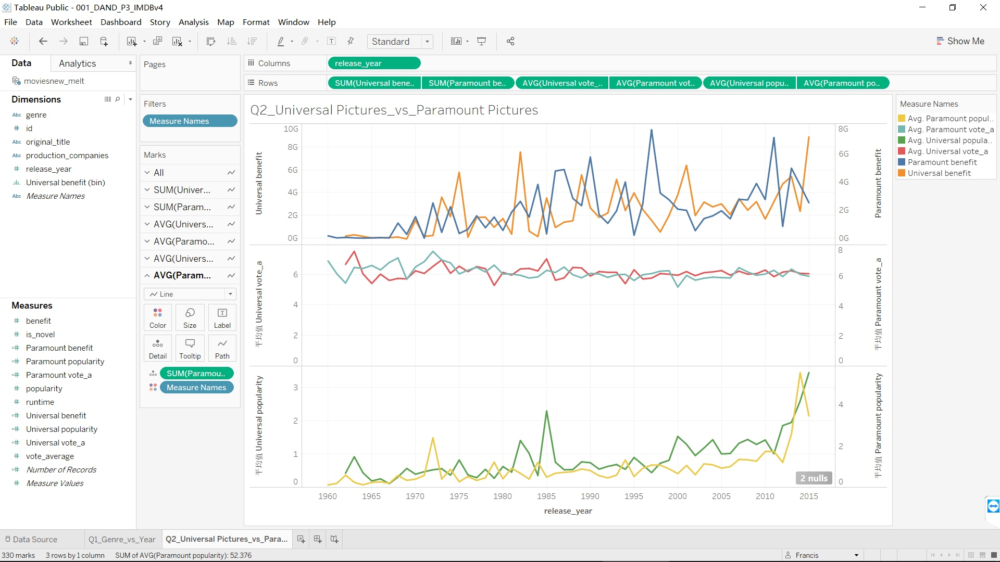

# Tableau

## Tableau是个啥东西

可以互动的数据视觉展示，可以看成可以互动的PPT图表。
Gartner排名名列前矛滴说。竞争对手有微软公司的PowerBI

## Tableau能带来什么

厉害的地方：
1. 好看
2. 能交互
3. 能实时获取数据

所以呢，我们可以用它：
1. 获取销售情况（比如电商），有针对性的营销
2. 在展示时候只在一个页面上展示超多数据，可以根据客户的关注点直接调整所需数据

## 这个家伙什么样子的

编辑界面：

