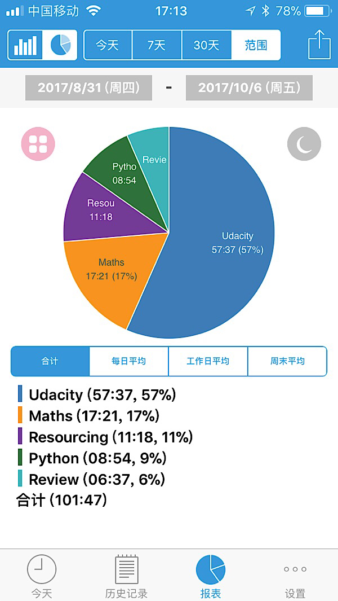

# # week6/12 项目3开始（P3 1/4）

## Key words

数据分析流程 SQL高级语言 数据清理

## 前面的话

同学们，这周我们讲开始学习项目3，如何进行数据集的探索。本周将会用到项目2中的Python知识，和项目1中的SQL知识，并且会做一些扩展。本项目新加入的知识点是怎样进行数据清理，因为现实世界的数据往往有很多瑕疵，而要想得到良好的分析结果，就要把这些瑕疵处理掉。大家加油！
    
## 学习计划



项目3的4周计划和Uda每日计划如下（本周是第3周）：

| 时间 | 学习重点 | 对应内容（按照名字找就好了） |
| --- | --- | --- |
| 第1周 | Python基础内容 | 数据类型和运算符、控制流、函数、脚本编写 |
| 第2周 | Python数据处理内容 | Numpy & Pandas - 第一、二部分 |
| 第3周 | 运用前2周的知识完成项目 | 项目：探索美国共享单车数据 |
| **第4周** | **项目修改与通过** | **修改项目、查缺补漏、休息调整** |

每周的时间还是按照这个进度，注意周六的时间是大家Classin视频讨论的时间，其他的可以灵活调配，记住目标不要拖过一周为妙，加油！

| 学习时间 | 学习资源 | 学习重点 |
| --- | --- | --- |
| 周3 | /助教/发布当周导学 | 浏览导学文件内容开始学习 |
| 周4 | /Uda/线上内容 | 学习Uda Classroom内容 |
| 周5 | /助教/1v1预约 | 难点可预约1v1语音指导 |
| 周6 | /助教/视频讲解 20:30-21:30 | 讲解本周导学内容、回答疑难问题 |
| 周7 | /助教/根据视频课程学习 | 完成本周内容内容 |
| 周1 | /小结/本周总结 | 总结、笔记、思考 |
| 周2 | /选学/自主学习修养 | 自主学习（选学部分）或调休 |

**重点提示：**

- **本周任务是项目通过！所以要尽早提交，因为评审老师会审阅反馈的！**
- 目标1、目标2、目标3对应的是3个teambition的勾勾，作为考核发礼物参考
- 请认真看本导读文件，如果同学是编程新手的话，一定记得多看、多试、多问，大家一起加油

## 本周目标

**不要怂，就是肝！大家High起来！** 3个目标对应的是：
> /目标1/：数据分析过程
> /目标2/：案例研究1、2
> /目标3/：了解项目3

### /目标1/：数据分析过程

#### {lesson1.2课程概述}

links for other resources

#### 1.3
linkes for example

#### 1.5数据分析过程概述

整理数据
- Gather
- Assess
- Clean

#### 1.9提问

肿瘤数据 https://archive.ics.uci.edu/ml/datasets/Breast+Cancer+Wisconsin+%28Diagnostic%29
肿瘤数据

### 探索数据集

中文数据集说明：
https://github.com/udacity/new-dand-basic-china/blob/master/%E6%95%B0%E6%8D%AE%E5%88%86%E6%9E%90%E5%85%A5%E9%97%A8/%E9%A1%B9%E7%9B%AE-%E6%8E%A2%E7%B4%A2%E6%95%B0%E6%8D%AE%E9%9B%86/%E6%8E%A2%E7%B4%A2%E6%95%B0%E6%8D%AE%E9%9B%86%20-%20%E5%A4%87%E9%80%89%E6%95%B0%E6%8D%AE%E9%9B%86.md

